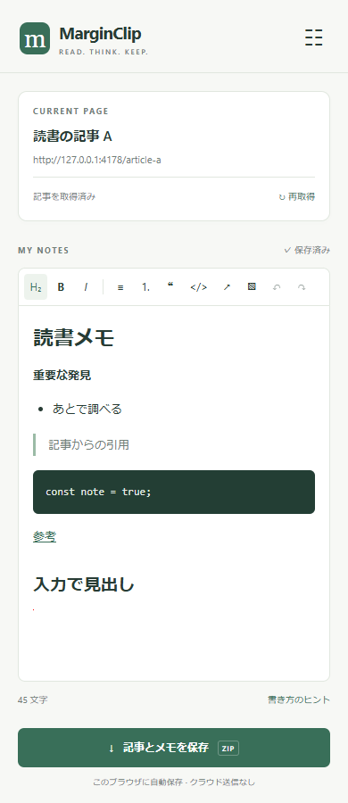

# MarginClip

**Webページの横に、考えを書き留める場所を。**

[](LICENSE)
[](docs/installation.md)
[](CONTRIBUTING.md)

MarginClipは、ChromeのサイドパネルでMarkdownメモを取る拡張機能です。Webページごとにメモを自動保存し、記事本文とメモをMarkdownとして持ち出せます。アカウントは不要で、データは利用中のChromeプロファイルに保存されます。



## 主な機能

- 見出し・リスト・引用・リンク・コードに対応したMarkdownエディタ
- 画像の貼り付け、ファイル選択、ドラッグ＆ドロップ
- URLごとの自動保存、再訪時の復元、メモ一覧の検索
- 記事本文・タイトル・著者・公開日時の取得
- 記事とメモのMarkdown書き出し、全メモのバックアップ・復元
- ライト／ダーク表示、複数ウィンドウでの同時編集の上書き防止

## はじめる

Google Chrome 116以降と、ビルド用のNode.js 24が必要です。

```sh
git clone https://github.com/T-Sumida/MerginClip.git
cd MerginClip
npm ci
npm run build
```

1. Chromeで `chrome://extensions` を開き、**デベロッパーモード**をONにします。
2. **パッケージ化されていない拡張機能を読み込む**から、生成された `dist` フォルダを選びます。
3. MarginClipをピン留めし、Webページ上でアイコンをクリックしてメモを書きます。

ビルド済みZIPが[Releases](https://github.com/T-Sumida/MerginClip/releases)で配布されている場合は、Node.jsなしでインストールできます。詳しい導入・更新・削除手順は[インストールガイド](docs/installation.md)を参照してください。現在の導入方法は手動読み込みです。

## Markdownへの書き出し

「記事とメモを保存」で、次の内容をZIPにまとめます。

```text
20261010_143000_記事タイトル_article.md
20261010_143000_記事タイトル_note.md
assets/                  # メモに画像がある場合
```

日時は保存開始時のローカル時刻です。記事中の画像は元のURLを参照し、ダウンロードしません。メモに貼り付けた画像は `assets/` に保存します。メモ中のリモート画像を取得できない場合は元URLを保持し、画面に警告を表示します。記事・メモのZIPには `README.txt` や `metadata.json` を含めません。

## データと対応範囲

メモはローカルのIndexedDBへ保存します。クラウド同期やアクセス解析はありません。ページ取得とメモ画像の書き出しに使う権限・通信については[プライバシー](docs/privacy.md)で説明しています。

一般的なHTTP／HTTPSページが対象です。Chromeの設定ページなどではページ取得を利用できません。サイトの構造によっては記事の抽出に失敗することがあり、表・数式などすべてのMarkdown記法の再現は保証していません。対応範囲は[ユーザーガイド](docs/user-guide.md)と[テスト・検証](docs/testing.md)を参照してください。

## ドキュメント

| 目的 | ガイド |
| --- | --- |
| インストール・更新 | [インストールガイド](docs/installation.md) |
| メモ・記事取得・バックアップ | [ユーザーガイド](docs/user-guide.md) |
| 権限・通信・データ保存 | [プライバシー](docs/privacy.md) |
| ビルド・テスト | [開発ガイド](docs/development.md) |
| 構成・保存形式・設計 | [アーキテクチャ](docs/architecture.md) |
| 配布ZIP・リリース | [リリース手順](docs/releasing.md) |
| 変更内容 | [変更履歴](CHANGELOG.md) |

[ドキュメント一覧](docs/README.md)からも参照できます。

## コントリビューション

不具合報告や改善提案は[Issues](https://github.com/T-Sumida/MerginClip/issues)へどうぞ。開発に参加する場合は[CONTRIBUTING](CONTRIBUTING.md)と[行動規範](CODE_OF_CONDUCT.md)を参照してください。日本語・英語のどちらでも歓迎します。脆弱性の報告は[SECURITY](SECURITY.md)に沿ってお願いします。

## ライセンス

[MIT License](LICENSE) — Copyright (c) 2026 T-Sumida and contributors.

利用ライブラリにはそれぞれのライセンスが適用されます。配布物に `THIRD_PARTY_NOTICES.txt` を同梱します。[利用ライブラリ](docs/architecture.md#利用ライブラリ)も参照してください。
